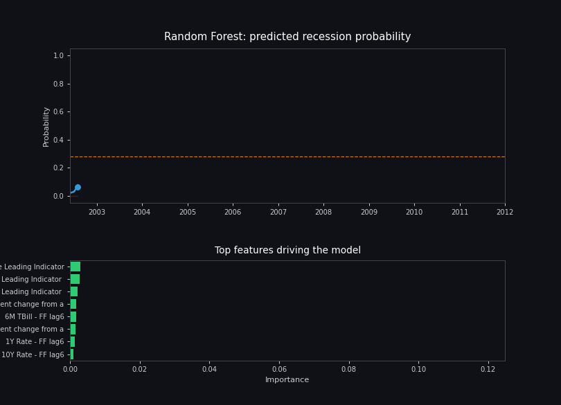
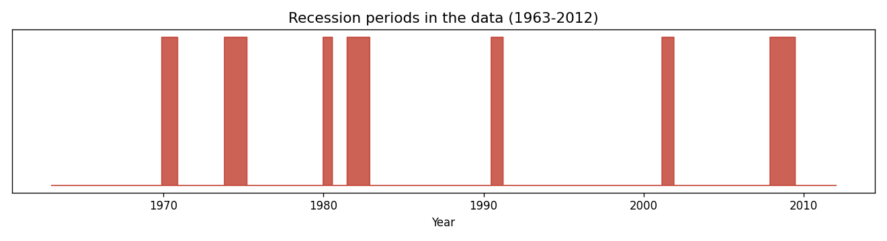
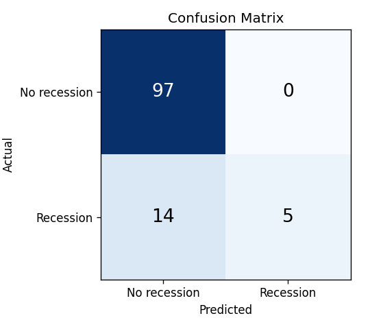
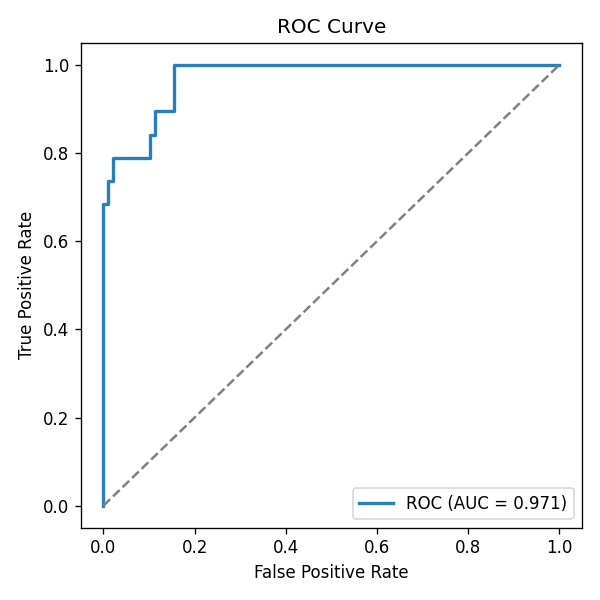
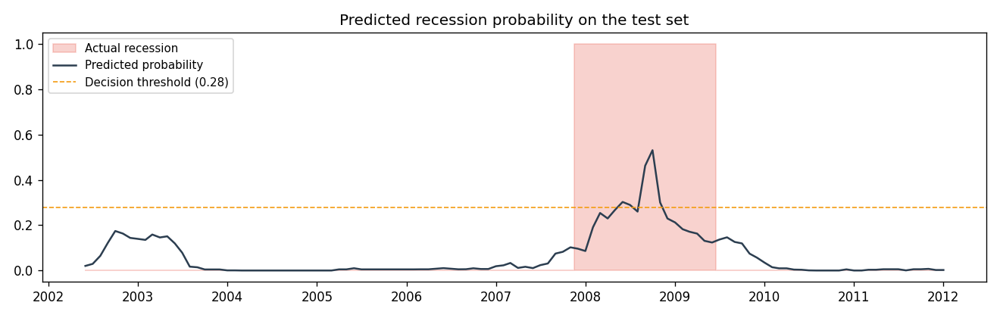
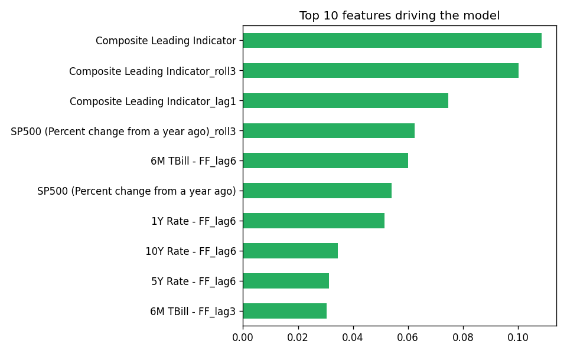

# Recession Prediction with Random Forest

A small project to see if a Random Forest can predict US recessions using monthly economic indicators from 1963 to 2012.

Here's the model in action ,
the top chart shows the predicted recession probability climbing as we approach the 2008 financial crisis (the shaded red area is the actual recession), and the bottom chart shows which features the model leaned on most heavily to make that call.

## The data

Monthly data: S&P500 returns, Treasury yield spreads (3-month to 10-year), and the Composite Leading Indicator, plus a recession label based on the NBER definition. There are 7 recessions in this period.

Recessions are rare — only about 15% of months. That matters a lot for how you evaluate the model later, since accuracy alone can be misleading here.

## What I did

**Features.** Economic indicators usually give a warning a few months before a recession actually hits, not the same month. So for every column I added lagged versions (1, 3, 6, 12 months back) and a 3-month rolling average. Went from 11 raw columns to 62 features.

**Train/test split.** Since this is time series data, I couldn't split randomly — that would leak future info into training. Used the first 80% of the timeline for training and the last 20% for testing.

**Model.** Random Forest with `class_weight='balanced'` to deal with the imbalance, tuned with GridSearchCV using TimeSeriesSplit (regular k-fold cross-validation doesn't respect time order).

**Threshold.** The default 0.5 cutoff for "recession or not" is too conservative when positives are rare. I found a better threshold (0.28) by testing different cutoffs on out-of-fold predictions from the training set.

## Results on the test set

| Metric | Score |
|---|---|
| Accuracy | 87.9% |
| Precision | 100% |
| Recall | 26% |
| F1-score | 0.42 |
| **ROC-AUC** | **0.971** |

### Confusion matrix

Out of 19 actual recession months in the test set, the model caught 5 of them, and never raised a false alarm (precision is 100%).

### ROC curve

AUC of 0.97 means the model is genuinely good at ranking risky months higher than safe ones — it's just being cautious about where it draws the line.

### Predicted probability during the test period

Black line is the model's predicted recession probability, red shading is the actual recession. You can see the probability climbs around the real recession, it just doesn't always cross the threshold.

### Feature importance

The Composite Leading Indicator (plus its lagged/smoothed versions) and S&P500 returns were the biggest drivers for the model.

## Files

- `recession_prediction.ipynb` — full notebook, runs end to end
- `leading_indicators.csv`, `recession_state.csv` — raw data
- `chart_*.png` — the charts in this README

